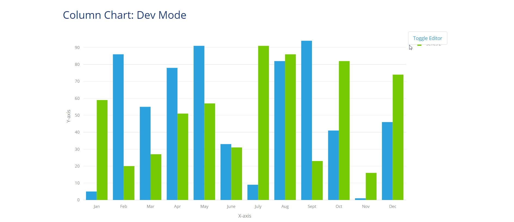
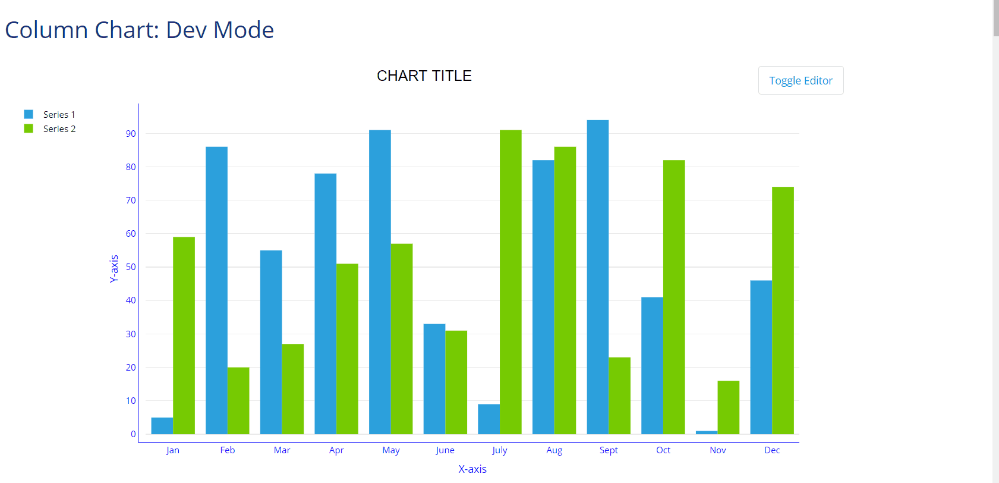
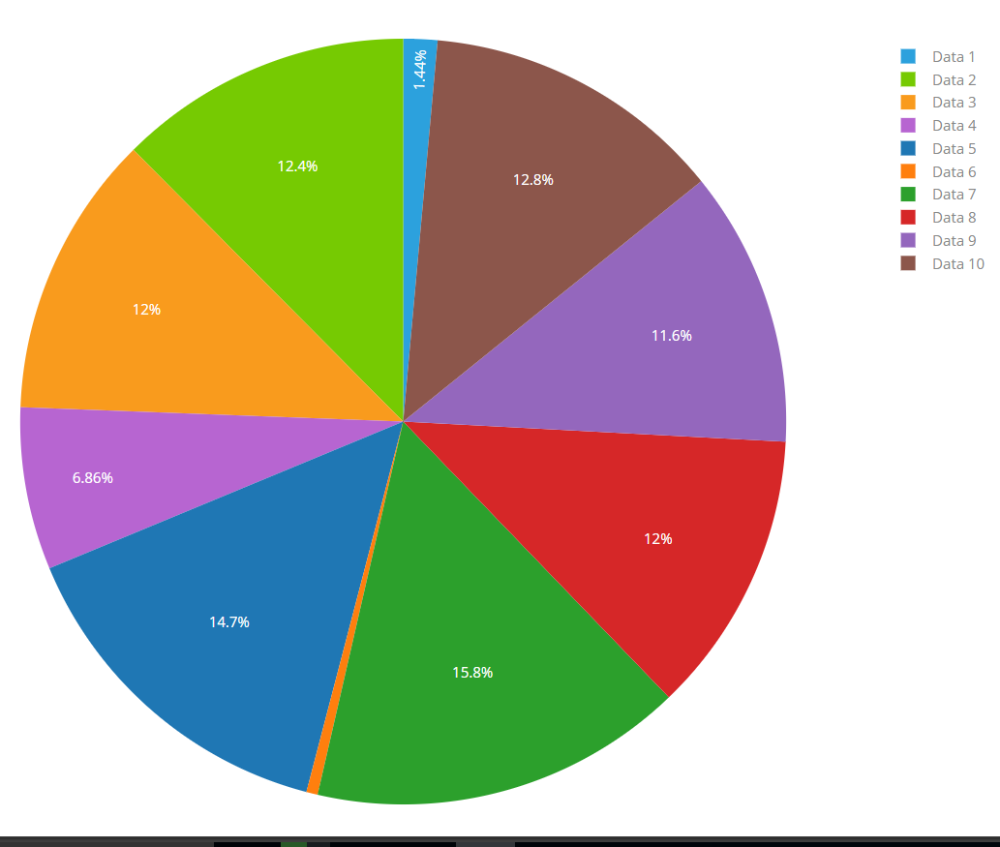
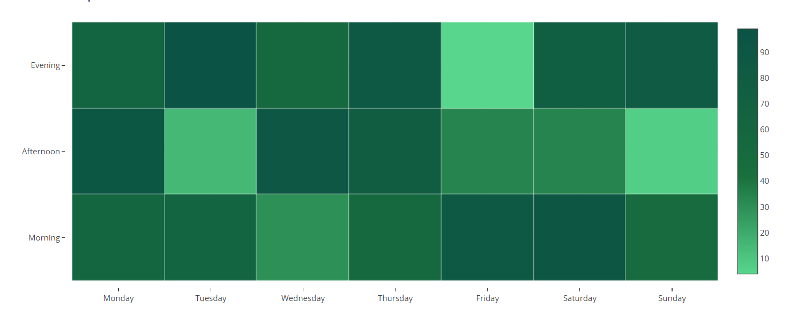
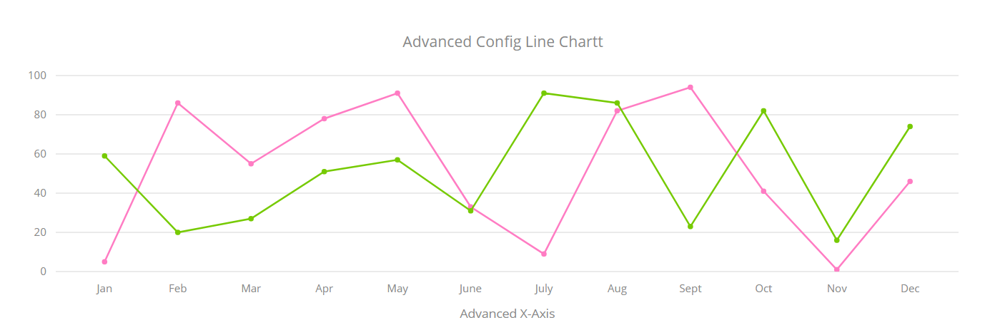
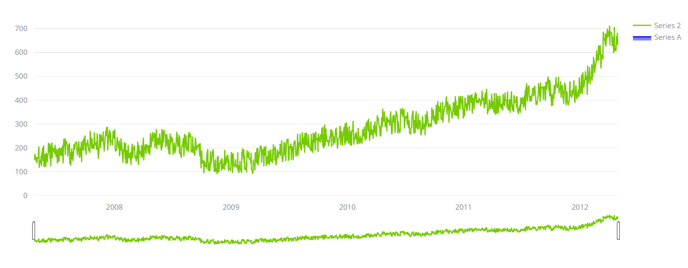

# Advanced configuration settings
A cheat sheet with snippets of JSON objects for easy and quick configuration of charts.

## Layout (all charts)
Layout controls the general appearance of the chart. The chart is customized by adding JSON properties to the layout.
Below is a basic configuration.  
``` JSON
{
  "font": {
    // font properties
  },
  "title": "CHART TITLE",
  "titlefont": {
    // title font properties
  },
  "autosize": true,
  "hovermode": "closest",
  "showlegend": true,
  "legend": {
    // legend properties
  },
  "hoverlabel": {
    // hover label properties
  },
  "margin": {
    // margin properties
  }
}
```
To use this layout snippet above, endeavour to replace all lines that begin with "// sometext properties" with actual properties specific to it.

### Legend
The legend properties below are added to the layout configuration to apply custom style to it. Below are legend properties
``` JSON
{
  "showlegend": true,
  "legend": {
    "bgcolor": "#fff",
    "bordercolor": "#444",
    "borderwidth": 0,
    "font":{
      "family": "Open Sans, verdana, arial, sans-serif",
      "size": 12,
      "color": "black"
    },
    "orientation": "v",
    "traceorder": "normal",
    "tracegroupgap": 10,
    "x": -0.1,
    "xanchor": "right"
  }
}
```
#### Right:
``` JSON
{
  "showlegend": true,
}
```
#### Left:
Adjust x for long series names or y axis ticks
``` JSON
{
  "showlegend": true,
  "legend": {
    "xanchor": "right",
    "x": -0.1
  }
}
```
#### Top:
``` JSON
{
  "showlegend": true,
  "legend": {
    "orientation": "h",
    "y": 1.1
  }
}
```
#### Bottom:
Adjust y to -0.2 for long x axis ticks
``` JSON
{
  "showlegend": true,
  "legend": {
    "orientation": "h",
    "y": "auto"
  }
}
```
#### Inside
``` JSON
{
  "showlegend": true,
  "legend": {
    "x": 0
  }
}
```
#### None:
``` JSON
{
  "showlegend": false
}
```

  
See more[ Legend configurations ](https://plot.ly/javascript/reference/#layout-legend)

### Axes
The axes properties apply to charts with x and y axes. They can be configured as:
``` JSON
{
  "xaxis": {
    "gridcolor": "#eaeaea",
    "title": "X-axis",
    "color": "#0000FF",
    "showgrid": false,
    "fixedrange": true,
    "showline": true,
    "side": "bottom"
  },
  "yaxis": {
    "rangemode": "tozero",
    "zeroline": true,
    "zerolinecolor": "#eaeaea",
    "gridcolor": "#eaeaea",
    "color": "#0000FF",
    "title": "Y-axis",
    "showgrid": true,
    "showline": true,
    "fixedrange": true
  }
}
```

  
See more[ Axes configurations ](https://plot.ly/javascript/reference/#layout-xaxis)

### Multiple Y axes
The properties apply to charts with more than one Y axis. They can be configured as:
``` JSON
{
  "title": "Any Chart Multiple Y axes",
  "yaxis": {
    "title": "Y-axis 1",
    "zeroline": true,
    "color": "#4682B4",
    "showgrid": true,
    "showline": true
  },
  "yaxis2": {
    "title": "Y-axis 2",
    "color": "#FF8C00",
    "showgrid": true,
    "showline": true,
    "zeroline": true,
    "overlaying": "y",
    "side": "right"
  }
}
```

The layout properties above should be used with the corresponding [ data properties ](#multiple-y-axes-data-properties).  
  
See more[ Multiple Y axes configurations ](https://plot.ly/javascript/multiple-axes/)

### Multiple X axes
These properties apply to charts with more than one X axis. They can be configured as:
``` JSON
{
  "xaxis": {
    "title": "X-axis 1",
    "color": "#4682B4",
    "showgrid": true,
    "showline": true,
    "zeroline": true
  },
  "xaxis2": {
    "title": "X-axis 2",
    "titlefont": {
      "color": "#FF8C00"
    },
    "tickfont": {
      "color": "#FF8C00"
    },
    "zeroline": true,
    "color": "#FF8C00",
    "showgrid": true,
    "showline": true,
    "overlaying": "x",
    "side": "top"
  }
}
````

The layout properties above should be used with the corresponding [ data properties ](#multiple-x-axes-data-properties).  
  
See more[ Multiple X axes configurations ](https://plot.ly/javascript/multiple-axes/)

#### Math LaTeX formulas
Titles, axis and series can contain complex mathematical expression.

```
$\sqrt{(n_\text{c}(t|{T_\text{early}}))}$
```
Add to the index.html of the theme.
``` javascript
<script type="text/javascript" async src="https://cdnjs.cloudflare.com/ajax/libs/mathjax/2.7.1/MathJax.js?config=TeX-AMS-MML_SVG"></script>
```
More information LatTex Syntax : https://en.wikibooks.org/wiki/LaTeX/Mathematics

### Title
The title appears above the chart. It can be configured as: 
``` JSON
{
  "title": "CHART TITLE",
  "titlefont": {
    "family": "Droid Sans, Droid Serif, sans-serif",
    "size": 20,
    "color": "black"
  }
}
```
  
See more[ Title configurations ](https://plot.ly/javascript/reference/#layout-title)  

### Color
Sets the a background color to graph.
``` JSON
{
  "paper_bgcolor": "#FFF"
}
```
### Margin
creates space around the chart.
``` JSON
{
  "margin": {
    "l": 70,
    "r": 60,
    "b": 60,
    "t": 60,
    "pad": 10,
    "autoexpand": true
  }
}
```

  
See more[ Margin configurations ](https://plot.ly/javascript/reference/#layout-margin)

### Tooltip
A small pop-up box that appears when the user moves the mouse pointer over an chart data points.
``` JSON
{
  "hovermode": "text",
  "hovertext": "text",
  "hoverinfo": "all",
  "textposition": "inside",
  "hoverlabel": {
    "bgcolor": "#888",
    "bordercolor": "#888",
    "font": {
      "color": "white"
    }
  }
}
```
  
See more [ Tooltip configurations ](https://plot.ly/javascript/reference/#layout-hovermode)

### Font
Sets a global font that will be applied to all chart elements.
``` JSON
{
  "font": {
    "family": "Open Sans,verdana, arial, sans-serif",
    "size": 12,
    "color": "black"
  }
}
```

## Data/Series Properties
These properties are applied to specific charts only. For each chart, data properties are distinct. They make the chart appear as its supposed to be.

### Column chart
Displays a series as a set of vertical bars that are grouped by category.
``` JSON
{
  "name": "Series A",
  "type": "bar",
  "hoverinfo": "y",
  "orientation": "v"
}
```
  
See more [ Column chart data properties ](https://plot.ly/javascript/reference/#bar)

### Bar chart
Displays a series as a set of horizontal bars that are grouped by category.
``` JSON
{
  "name": "Series B",
  "type": "bar",
  "hoverinfo": "x",
  "orientation": "h"
}
```
  
See more [ Bar chart data properties ](https://plot.ly/javascript/reference/#bar)

### Pie Chart
 Displays a circular graph divided into slices to illustrate numerical proportion.
``` JSON
{
  "hole": 0,
  "hoverinfo": "label",
  "type": "pie",
  "sort": false
}
```
  
See more [ Pie chart data properties ](https://plot.ly/javascript/reference/#pie)

### Area chart
Displays a line chart with the areas below the lines filled with colors.
``` JSON
{
  "connectgaps": true,
  "hoveron": "points",
  "hoverinfo": "y",
  "line": {
    "color": "#17202A",
    "shape": "linear",
    "dash": "dot"
  },
  "mode": "lines",
  "name": "Series",
  "type": "scatter",
  "fill": "tonexty",
  "fillcolor": "#B2BABB"
}
```

  
See more [ Area chart data properties ](https://plot.ly/javascript/reference/#area)

### Heat Map
Displays a two-dimensional representation of data in which values are represented by colors.  
``` JSON
{
  "type": "heatmap",
  "hoverinfo": "text",
  "xgap": 0.5,
  "ygap": 0.5,
  "showscale": true,
  "colorscale": [
    [ 0, "#58D68D" ],
    [ 0.4, "#196F3D" ],
    [ 1, "#0B5345" ]
  ]
}
```
  
See more [ Heatmap data properties ](https://plot.ly/javascript/reference/#heatmap)  

### Line chart
Displays a graph of data that changes continuously over time.
``` JSON
{
  "connectgaps": true,
  "hoveron": "points",
  "hoverinfo": "y",
  "line": {
    "color": "",
    "shape": "linear"
  },
  "mode": "lines+markers",
  "name": "Series B",
  "type": "scatter",
  "fill": "none"
}
```

See more [ Line chart data properties ](https://plot.ly/javascript/reference/#scatter)

### Time series
Displays a graph of data points at successive time intervals.  
``` JSON
{
  "connectgaps": true,
  "hoveron": "points",
  "hoverinfo": "y",
  "line": {
    "color": "blue",
    "shape": "linear"
  },
  "mode": "lines",
  "name": "Series A",
  "type": "scatter",
  "fill": "tonexty"
}
```



#### Filter buttons


``` JSON
{
  "xaxis": {
    "rangeselector": {
      "buttons": [
        {
          "step": "all",
          "label": "reset"
        },
        {
          "step": "year",
          "stepmode": "backward",
          "count": 1,
          "label": "1 YEAR"
        },
        {
          "step": "year",
          "stepmode": "backward",
          "count": 5,
          "label": "5 YEARS"
        },
        {
          "step": "year",
          "stepmode": "backward",
          "count": 10,
          "label": "10 YEARS"
        },
        {
          "step": "year",
          "stepmode": "todate",
          "count": 1,
          "label": "YTD"
        }
      ]
    }
  }
}
```

See more [ Time series data properties ](https://plot.ly/javascript/reference/#scatter)

### Multiple Y axes data properties
Displays a two different Y axes with different scales, in the data set.
``` JSON
[
  {
    "name": "yaxis2 data",
    "yaxis": "y2",
    "type": "scatter"
  },
  {
    "name": "yaxis data",
    "type": "scatter"
  }
]
```

### Multiple X axes data properties
Displays a two different X axes with different scales.
``` JSON
[
  {
    "name": "xaxis data",
    "xaxis": "x",
    "type": "scatter"
  },
  {
    "name": "xaxis2 data",
    "xaxis": "x2",
    "type": "scatter"
  }
]
```
