# Advanced configuration settings
A cheat sheet with snippets of JSON objects for easy and quick configuration of charts.

## Layout (all charts)
Layout controls the general appearance of the chart. The chart is customized by adding JSON properties to the layout.
Below is a basic configuration.  

    {
        "font": {
            // font properties
        },
        "title": "CHART TITLE",
        "titlefont": {
            // titlefont properties
        },
        "autosize": true,
        "hovermode": "closest",
        "showlegend": true,
        "legend": {
            // legend properties
        },
        "hoverlabel": {
            // hoverlabel properties
        },
        "margin": {
            // margin properties
        }
    }

To use this layout snippet above, endeavour to replace all lines that begin with "// sometext properties" with actual properties specific to it.

### Legend
The legend properties below are added to the layout configuration to apply custom style to it. Below are legend properties

    {
        "showlegend": true,
        "legend": {
            "bgcolor": "#fff",
            "bordercolor": "#444",
            "borderwidth": 0,
            "font":{
                "family": "Open Sans, verdana, arial, sans-serif",
                "size": 12,
                "color": "black"
            },
            "orientation": "v",
            "traceorder": "normal",
            "tracegroupgap": 10,
            "x": -0.1,
            "xanchor": "right"
        }
    }

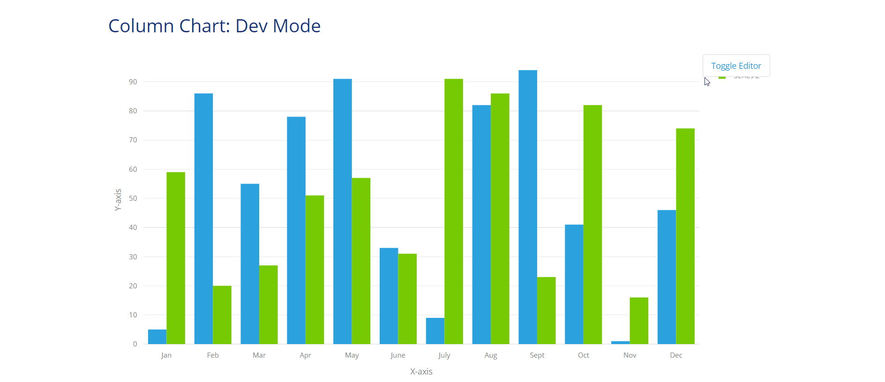  

### Axes
The axes properties apply to charts with two or more axes. They can be configured as: 

    {
        "xaxis": {
            "gridcolor": "#eaeaea",
            "title": "X-axis",
            "color":"blue",
            "showgrid": false,
            "fixedrange": true,
            "showline": true,
            "side": "bottom"
        },
        "yaxis": {
            "rangemode": "tozero",
            "zeroline": true,
            "zerolinecolor": "#eaeaea",
            "gridcolor": "#eaeaea",
            "color":"blue",
            "title": "Y-axis",
            "showgrid": true,
            "showline": true,
            "fixedrange": true
        }
    }

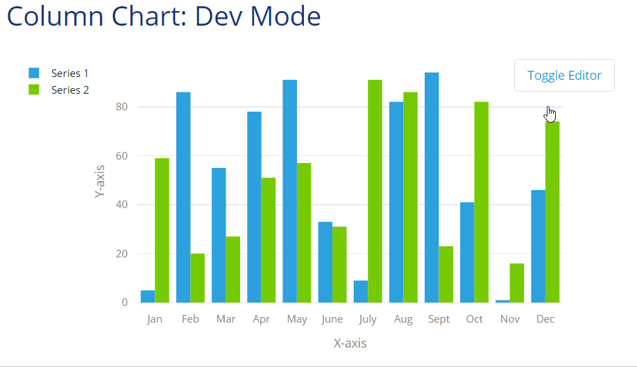  

### Title
The title appears above the chart. It can be configured as: 

    {
        "title": "CHART TITLE",
        "titlefont": {
            "family": "Droid Sans, Droid Serif, sans-serif",
            "size": 20,
            "color": "black"   
        }
    }

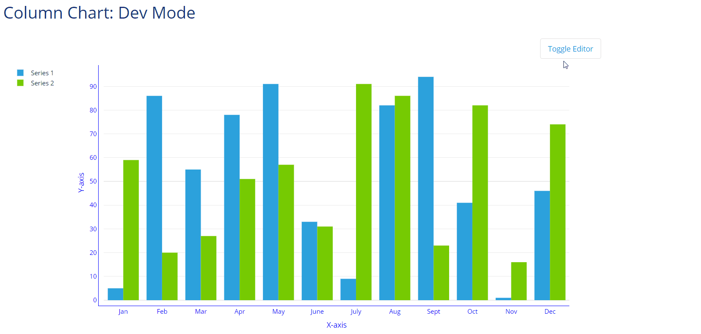  

### Color
Sets the a background color to graph.

    {
        "paper_bgcolor": "#FFF"
    }

### Margin
creates space around the chart.

    {
        "margin": {
            "l": 70,
            "r": 60,
            "b": 60,
            "t": 60,
            "pad": 10,
            "autoexpand": true
        }
    }

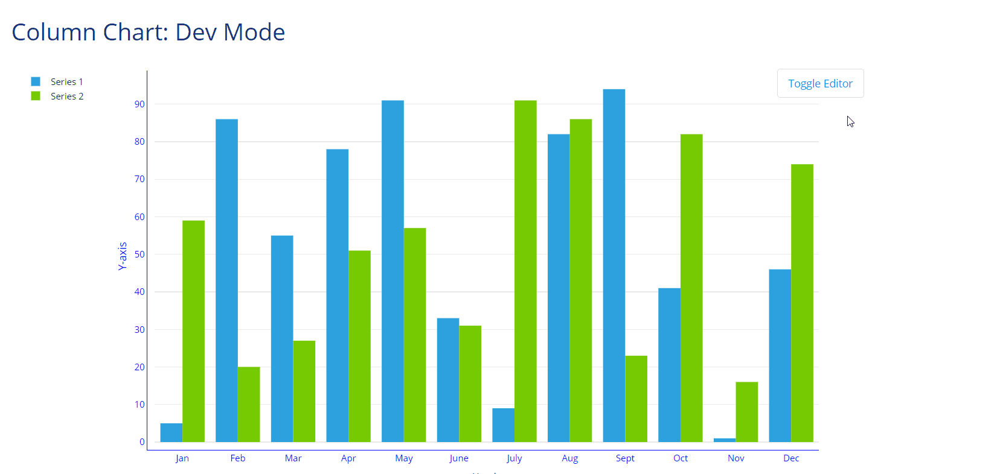  

### Tooltip
A small pop-up box that appears when the user moves the mouse pointer over an chart data points.

    {
        "hovermode": "text",
        "hovertext": "text",
        "hoverinfo": "all",
        "textposition":"inside",
        "hoverlabel": {
            "bgcolor": "#888",
            "bordercolor": "#888",
            "font": {
                "color": "white"
            }
        }
    }

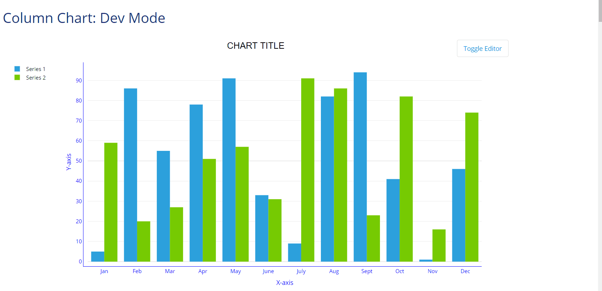  

### Font
Sets a global font that will be applied to all chart elements.

    {
        "font": {
            "family": "Open Sans, sans-serif",
            "size": 12,
            "color": "black"
        }
    }

## Data/Series Properties
These properties are applied to specific charts only. For each chart, data properties are distinct. They make the chart appear as its supposed to be.

### Column chart
Displays a series as a set of vertical bars that are grouped by category.

    {
        "name": "Series A",
        "type": "bar",
        "hoverinfo": "y",
        "orientation": "v"
    }

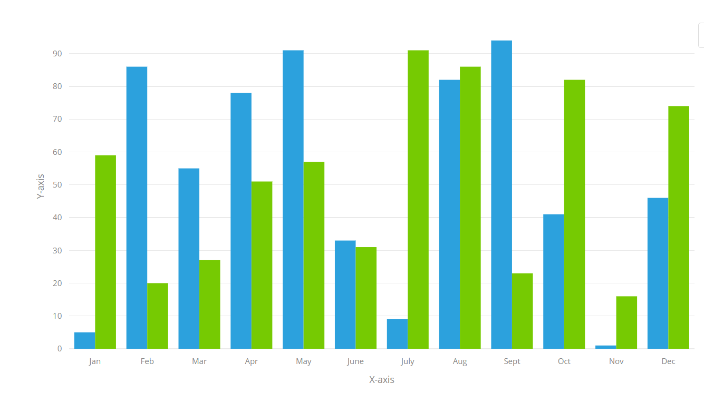  

### Bar chart
Displays a series as a set of horizontal bars that are grouped by category.

    {
        "name": "Series B",
        "type": "bar",
        "hoverinfo": "x",
        "orientation": "h"
    }

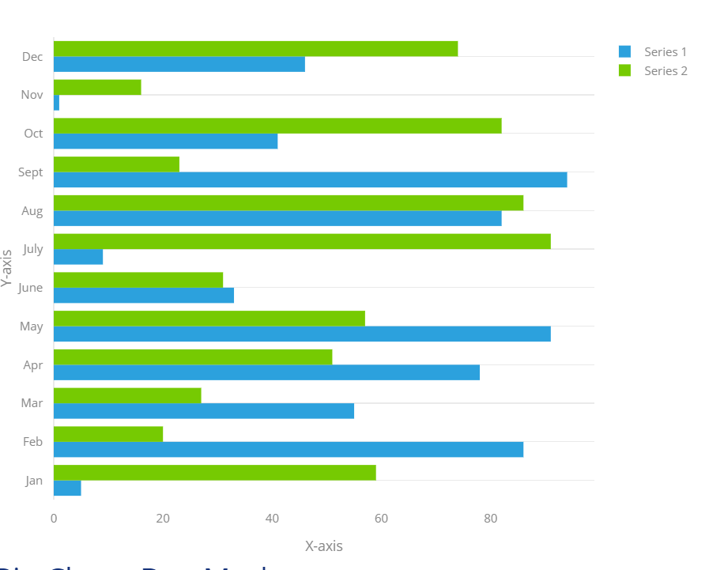  

### Pie Chart
 Displays a circular graph divided into slices to illustrate numerical proportion.

    {
        "hole": 0,
        "hoverinfo": "label",
        "type": "pie",
        "sort": false
    }

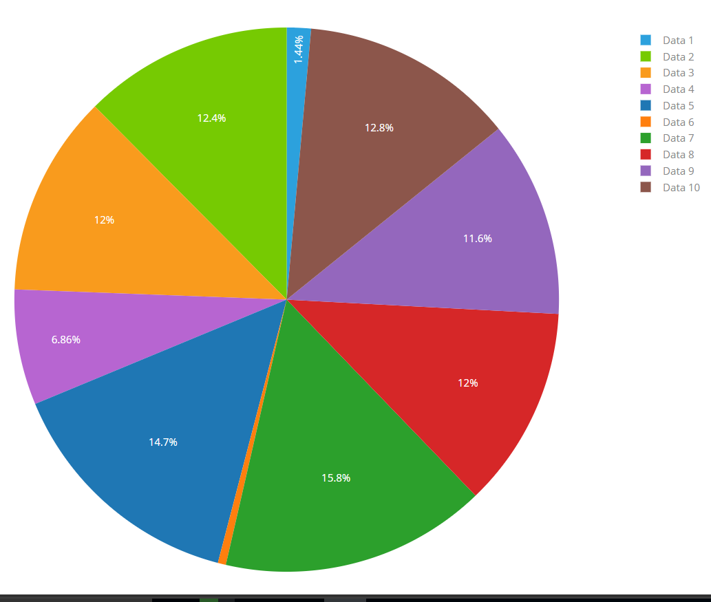  

### Area chart
Displays a line chart with the areas below the lines filled with colors.

    {
        "connectgaps": true,
        "hoveron": "points",
        "hoverinfo": "y",
        "line": {
            "color": "#17202A",
            "shape": "linear",
            "dash": "dot"
        },
        "mode": "lines",
        "name": "Series",
        "type": "scatter",
        "fill": "tonexty",
        "fiilcolor": "#B2BABB"
    }

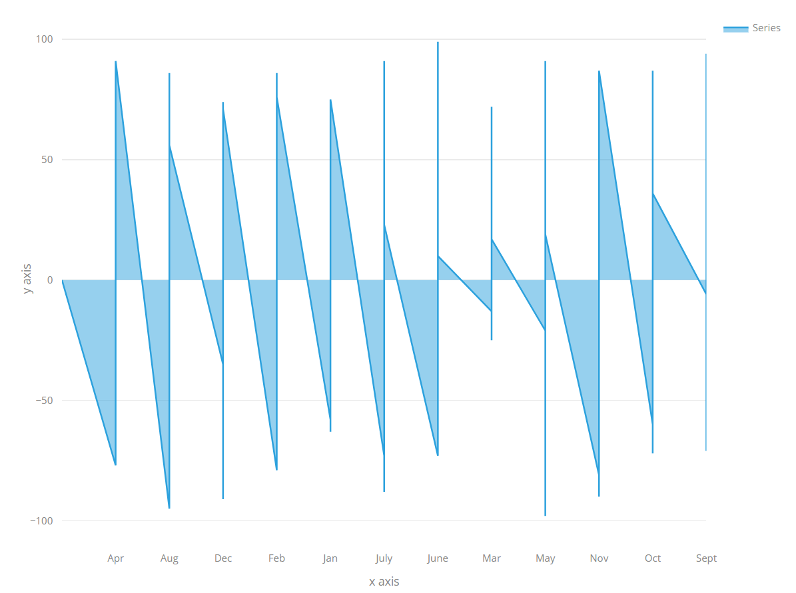  

### Heat Map
Displays a two-dimensional representation of data in which values are represented by colors.

    {
        "type": "heatmap",
        "hoverinfo": "text",
        "xgap": 0.5,
        "ygap": 0.5,
        "showscale": true,
        "colorscale": [
            [
                0,
                "#58D68D"
            ],
            [
                0.4,
                "#196F3D"
            ],
            [
                1,
                "#0B5345"
            ]
        ]
    }

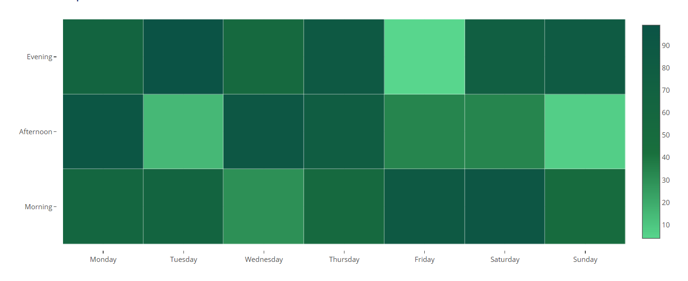  

### Line chart
Displays a graph of data that changes continuously over time.

    {
        "connectgaps": true,
        "hoveron": "points",
        "hoverinfo": "y",
        "line": {
            "color": "",
            "shape": "linear"
        },
        "mode": "lines+markers",
        "name": "Series B",
        "type": "scatter",
        "fill": "none"
    }

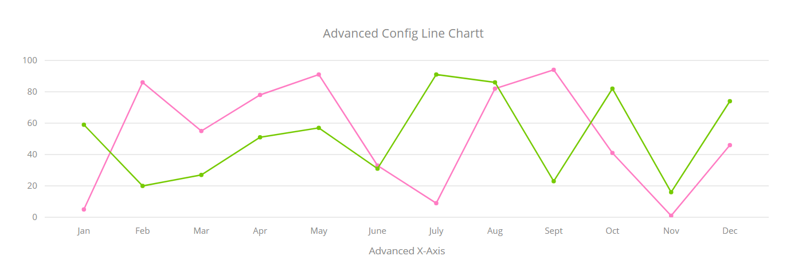  

### Time series
Displays a graph of data points at successive time intervals.
    {
        "connectgaps": true,
        "hoveron": "points",
        "hoverinfo": "y",
        "line": {
            "color": "blue",
            "shape": "linear"
        },
        "mode": "lines",
        "name": "Series A",
        "type": "scatter",
        "fill": "tonexty"
    }

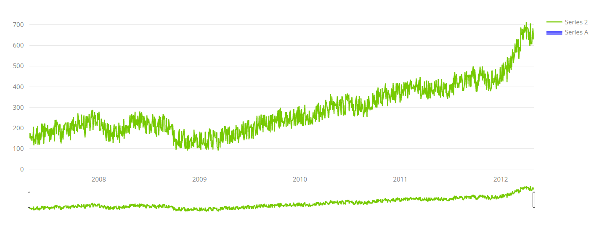  
